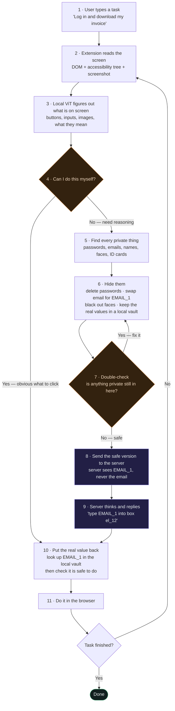
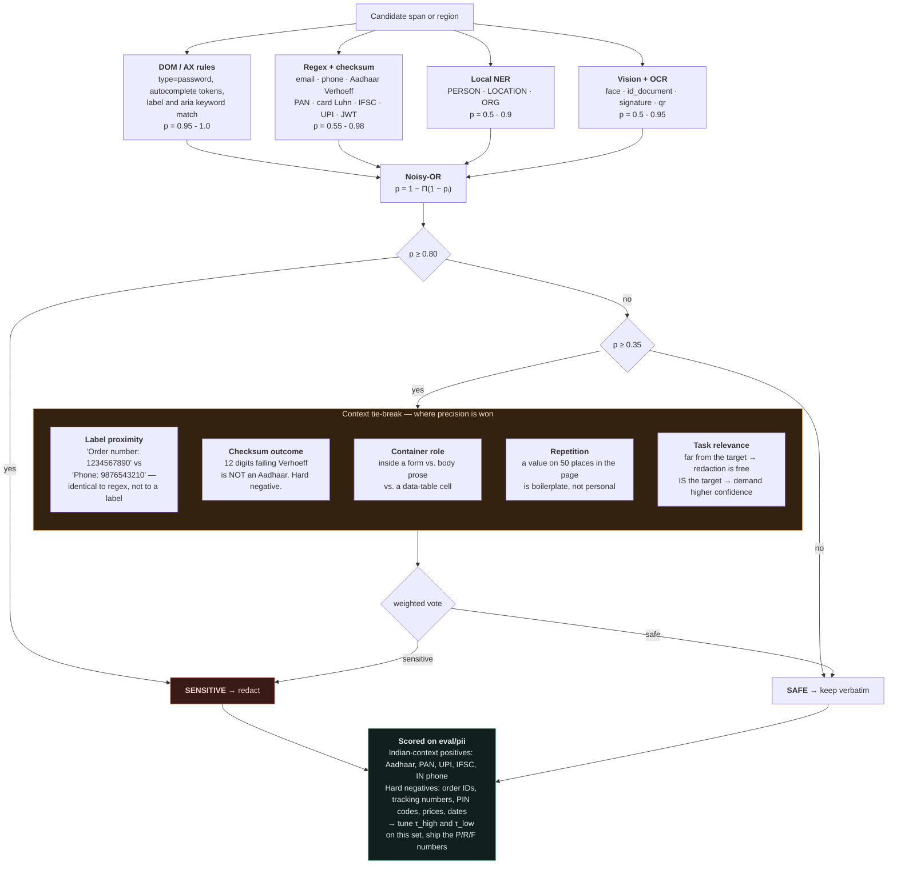
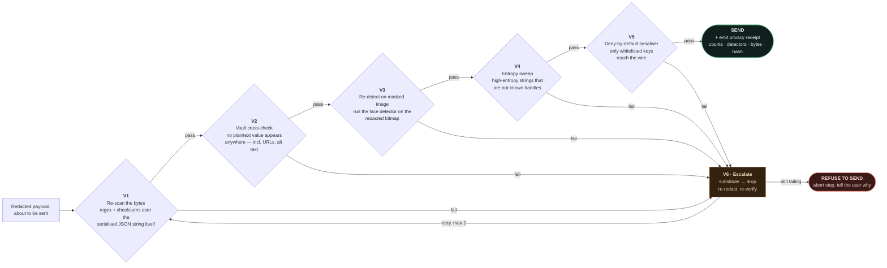

# Cordon — Mermaid Diagrams

Paste any block into **https://mermaid.live** to render / export PNG or SVG.
Rewritten against the real SIH26171 text and its five weighted metrics.

---

## 0. The basic version — start here

> Eleven steps. This is how the whole thing works. Everything after this diagram
> is one of these boxes opened up.

**The three boxes that matter:**

- **Box 3** is worth 25% of the marks — the local vision model understanding the screen.
- **Box 4** is why we're fast — if the answer is "yes", steps 5 to 9 never happen at all.
- **Box 7** is the promise — nothing leaves until this passes.

---

## 1. Master flowchart — the whole system

> This is the one to put on the architecture slide. Every stage is annotated with the
> metric it earns. Note the **Router** at stage 3: the server is an escalation path,
> not a mandatory step.

```mermaid
flowchart TD
    U(["User task<br/>'Fill this job application from my profile'"]) --> S1

    subgraph S1["1 · CAPTURE — on device"]
        direction LR
        DOMC["DOM + Accessibility tree"]
        SHOT["Screenshot<br/>OffscreenCanvas → 768px"]
        TXT["Visible text<br/>+ Range client rects"]
    end

    S1 --> COV

    subgraph S2["2 · PERCEIVE — visual context · METRIC 1 · 25%"]
        direction TB
        COV["<b>Coverage map</b><br/>which pixels does the DOM already explain?"]
        CHEAP["<b>Explained pixels</b><br/>DOM / AX is authoritative<br/>~0 ms, confidence 0.95-1.0"]
        PROP["<b>Unexplained pixels</b><br/>img · canvas · svg · video · iframe<br/>background-image · closed shadow root<br/>→ 5-20 crops, not a full frame"]
        DET2["UI detector, int8 ONNX<br/>WebGPU → WASM fallback"]
        VIT["<b>ViT-Tiny classifier</b><br/>224px crops, batched"]
        FUSE1["<b>FUSE → ScreenGraph</b><br/>elements · groups · reading order · focus<br/>IoU match; DOM wins on state,<br/>vision wins inside canvas/images"]
        COV --> CHEAP --> FUSE1
        COV --> PROP --> DET2 --> VIT --> FUSE1
    end

    S2 --> ROUTE

    ROUTE{"<b>3 · ROUTER</b><br/>can I resolve this on device?"}
    ROUTE -->|"YES · conf ≥ 0.9<br/><b>0 ms · no network</b>"| RES
    ROUTE -->|"AMBIGUOUS or IRREVERSIBLE"| ASKU
    ROUTE -->|"NEEDS REASONING"| S3

    ASKU(["Ask the user"]) --> RES

    subgraph S3["4 · DETECT PII — METRIC 2 · 20% · recall AND precision"]
        direction TB
        D1["DOM + AX rules<br/>0.95 - 1.0"]
        D2["Regex + Verhoeff / Luhn<br/>0.55 - 0.98"]
        D3["Local NER<br/>0.5 - 0.9"]
        D4["Vision + OCR<br/>0.5 - 0.95"]
        NOR["<b>Noisy-OR fusion</b><br/>p = 1 − Π(1 − pᵢ)"]
        THR{"p ≥ 0.80 ?"}
        TIE{"<b>Context tie-break</b><br/>label proximity · checksum result<br/>container role · repetition · task relevance"}
        SENS["SENSITIVE"]
        SAFE["SAFE — keep verbatim"]
        D1 --> NOR
        D2 --> NOR
        D3 --> NOR
        D4 --> NOR
        NOR --> THR
        THR -->|yes| SENS
        THR -->|"0.35 ≤ p < 0.80"| TIE
        THR -->|"p < 0.35"| SAFE
        TIE -->|sensitive| SENS
        TIE -->|safe| SAFE
    end

    S3 --> S4

    subgraph S4["5 · REDACT — METRIC 3 · 20% · precision"]
        direction TB
        VAULT[("<b>LOCAL VAULT</b><br/>handle → value + allowedSinks<br/>never serialised to network")]
        DROP["<b>DROP</b><br/>password · OTP · API key<br/>value never read into the payload"]
        SUB["<b>SUBSTITUTE</b><br/>EMAIL_1 · PERSON_1 · CARD_1<br/>typed and stable handles"]
        MASK["<b>TIGHT BBOX MASK</b><br/>Range.getClientRects per span<br/>detector box + 4px margin<br/><i>never the whole element or frame</i>"]
        PAY["Sanitized payload"]
        DROP --> PAY
        SUB --> PAY
        MASK --> PAY
        SUB --- VAULT
    end

    S4 --> VER

    VER{"<b>6 · VERIFY — independent gate, has a veto</b><br/>V1 re-scan serialised bytes · V2 vault cross-check<br/>V3 re-detect faces on the MASKED image<br/>V4 entropy sweep · V5 key whitelist"}
    VER -->|"FAIL · V6 escalate<br/>substitute → drop"| S4
    VER -->|"still failing after 2"| REFUSE(["<b>REFUSE TO SEND</b><br/>abort step, tell the user why"])
    VER -->|PASS| BOUND

    BOUND{{"<b>PRIVACY BOUNDARY</b><br/>crosses → ScreenGraph in handles, optional masked bitmap<br/>never → raw pixels of PII · field values · the vault"}}
    BOUND --> LLM

    subgraph SRV["7 · SERVER — open-weights VLM, offline-deployable"]
        direction TB
        LLM["<b>Qwen2.5-VL / Llama-3.2-Vision</b><br/>redaction grammar in the system prompt"]
        GUARD{"<b>Output guard</b><br/>guided JSON + reject literal PII"}
        LLM --> GUARD
        GUARD -->|dirty| LLM
    end

    GUARD -->|clean| RESP{"<b>Response type</b>"}
    RESP -->|"action"| RES
    RESP -->|"plan · up to 3 steps"| RES
    RESP -->|"data"| ANSWER(["Show the answer to the user"])
    RESP -->|"ask_user"| ASKU
    RESP -->|"need_image"| IMG["Send masked bitmap<br/>next turn only"]
    IMG --> S4

    subgraph EX["8 · RESOLVE + EXECUTE — on device"]
        direction TB
        RES["<b>E1</b> Resolve handle from vault"]
        SINK{"<b>E1</b> allowed sink for this class?"}
        POL{"<b>E2</b> policy · origin · step cap<br/>irreversible → human confirm"}
        GND{"<b>E3</b> ground · does the element<br/>signature still match?"}
        EXEC["<b>E4</b> execute<br/>focus + native setter + input/change"]
        VFY["<b>E4</b> verify post-condition<br/>diff the ScreenGraph"]
        BLOCK["<b>REFUSE</b><br/>not an allowed sink —<br/>likely prompt injection"]
        RECAP["Re-perceive instead of clicking"]
        RES --> SINK
        SINK -->|no| BLOCK
        SINK -->|yes| POL
        POL -->|blocked| BLOCK
        POL -->|allowed| GND
        GND -->|"page changed"| RECAP
        GND -->|match| EXEC --> VFY
    end

    VAULT -.->|"resolved locally, last moment"| RES
    RECAP --> S1
    VFY -->|"more steps"| S1
    VFY -->|"done"| FIN(["Task complete<br/>+ privacy receipt"])

    style S1 fill:#11201f,stroke:#4CC5D0
    style S2 fill:#11201f,stroke:#4CC5D0
    style S3 fill:#11201f,stroke:#4CC5D0
    style S4 fill:#11201f,stroke:#4CC5D0
    style EX fill:#11201f,stroke:#4CC5D0
    style SRV fill:#221f45,stroke:#9B93F5
    style VAULT fill:#1f3a3d,stroke:#4CC5D0,color:#e6eced
    style BOUND fill:#33220f,stroke:#E39A57,color:#f0d9c0
    style ROUTE fill:#33220f,stroke:#E39A57,color:#f0d9c0
    style VER fill:#33220f,stroke:#E39A57,color:#f0d9c0
    style REFUSE fill:#3a1a17,stroke:#F08A7E,color:#f5d5d1
    style BLOCK fill:#3a1a17,stroke:#F08A7E,color:#f5d5d1
    style FIN fill:#11201f,stroke:#5FC08F,color:#e6eced
```

---

## 2. End-to-end sequence — showing that most steps never leave the device

```mermaid
sequenceDiagram
    autonumber
    actor User
    participant Ext as Extension · on device
    participant Vault as Local Vault · on device
    participant Page as Web Page
    participant Srv as Server VLM

    User->>Ext: "Fill this job application from my profile"

    rect rgb(17, 32, 31)
        Note over Ext,Page: PERCEIVE — metric 1
        Ext->>Page: Read DOM + accessibility tree
        Page-->>Ext: Element candidates
        Ext->>Ext: Coverage map → 12 unexplained crops
        Ext->>Ext: Detector → ViT-Tiny → fuse into ScreenGraph
    end

    Note over Ext: ROUTER — resolvable locally?

    rect rgb(17, 32, 31)
        Note over Ext,Page: LOCAL PATH — no network at all
        Ext->>Vault: Field el_3 classified PERSON, conf 0.96
        Vault-->>Ext: Real name + allowedSinks
        Ext->>Page: Ground, then type
        Page-->>Ext: Value landed
    end

    Note over Ext: Field el_9 is an unlabelled textarea — ambiguous. Escalate.

    rect rgb(17, 32, 31)
        Note over Ext: SANITIZE — metrics 2 and 3
        Ext->>Ext: 4 detectors → noisy-OR → thresholds → tie-break
        Ext->>Vault: Mint handles for sensitive values
        Ext->>Ext: Drop / substitute / tight-mask
        Ext->>Ext: Verifier V1-V5 · PASS
    end

    rect rgb(51, 34, 15)
        Note over Ext,Srv: PRIVACY BOUNDARY — handles only, no image this turn
        Ext->>Srv: ScreenGraph + task + history
        Srv->>Srv: Reason over sanitized context
        Srv-->>Ext: fill el_9 with EXPERIENCE_1
    end

    Ext->>Vault: Resolve EXPERIENCE_1
    Vault-->>Ext: Real value
    Ext->>Ext: E1 sink check · E2 policy · E3 ground
    Ext->>Page: E4 execute
    Page-->>Ext: New DOM state
    Ext->>Ext: E4 verify post-condition
    Ext-->>User: Privacy receipt · 1 network call in 6 steps

    Note over Ext,Page: Submit is irreversible → PAUSE for explicit confirmation
    Ext-->>User: "Ready to submit. Review what will be sent?"
```

---

## 3. Metric 1 detail — how visual context is built and measured

```mermaid
flowchart TD
    FRAME["Current viewport"] --> COV["<b>Coverage map</b><br/>rasterise every known element bbox"]
    COV --> EXPL
    COV --> UNEXPL

    EXPL["<b>Explained</b><br/>inputs · buttons · links · text nodes"]
    UNEXPL["<b>Unexplained</b><br/>img · canvas · svg · video · iframe<br/>CSS background · closed shadow root<br/>high-entropy regions with no DOM node"]

    EXPL --> DOMEV["DOM evidence<br/>role · name · type · state · bbox"]
    UNEXPL --> PROP["Proposal: UI detector, int8"]
    PROP --> CROPS["5 - 20 crops"]
    CROPS --> VIT["ViT-Tiny, batched on WebGPU"]
    VIT --> VISEV["Vision evidence<br/>box · class · confidence"]

    DOMEV --> MATCH{"<b>Match by IoU ≥ 0.5</b>"}
    VISEV --> MATCH

    MATCH -->|"both agree"| A1["confidence 1.0<br/>the common case"]
    MATCH -->|"DOM only, no pixels"| A2["<b>visible: false</b><br/>occluded or offscreen —<br/>stops the agent clicking<br/>a node that is not on screen"]
    MATCH -->|"vision only, no DOM"| A3["<b>virtual element</b><br/>canvas app / custom widget<br/>vision is authoritative"]
    MATCH -->|"role conflict"| A4["DOM wins for input/button/a<br/>vision wins inside canvas or img"]

    A1 --> SG
    A2 --> SG
    A3 --> SG
    A4 --> SG
    SG["<b>ScreenGraph</b><br/>elements · groups · reading order · focus"]

    SG --> EVAL

    subgraph EVAL["Measured on eval/screens — 40-60 labelled pages"]
        direction LR
        M1["Element P / R / F1<br/>at IoU ≥ 0.5"]
        M2["Role accuracy<br/>confusion matrix"]
        M3["Mean bbox IoU"]
        M4["Task-relevant<br/>hit rate"]
    end

    CACHE[("Cache<br/>subtree hash → classification<br/>crop hash → vision result")]
    CACHE -.-> COV
    CACHE -.-> VIT
    DELTA["MutationObserver + IntersectionObserver<br/>mark dirty subtrees only"] -.->|"next step re-analyses<br/>what changed, not the page"| FRAME

    style A2 fill:#33220f,stroke:#E39A57,color:#f0d9c0
    style A3 fill:#221f45,stroke:#9B93F5,color:#e6eced
    style SG fill:#1f3a3d,stroke:#4CC5D0,color:#e6eced
    style EVAL fill:#11201f,stroke:#5FC08F
```

---

## 4. Metric 2 detail — calibrated detection, not blind over-redaction

> The corrected fusion. Over-redacting used to look "safe"; under this rubric it costs
> marks on metric 2 *and* metric 3.

---

## 5. The verifier — the gate

---

## 6. Scale — corrected

> Your original scale diagram assumed one server round trip per step. With local-first
> routing most steps never leave the device, which is a **stronger** slide: the fleet
> only sees the hard fraction, and only ever as sanitized JSON.

```mermaid
flowchart TD
    subgraph CLIENTS["1,000,000 USER DEVICES — where the heavy work happens"]
        direction LR
        D1["Device 1<br/>capture · ViT · PII · redact<br/>vault · route · execute"]
        D2["Device 2<br/>capture · ViT · PII · redact<br/>vault · route · execute"]
        DN["Device N<br/>capture · ViT · PII · redact<br/>vault · route · execute"]
    end

    CLIENTS --> ROUTER{"<b>Router, on each device</b>"}
    ROUTER -->|"majority of steps<br/>resolved locally"| LOCALDONE(["Executed on device<br/><b>0 network calls</b>"])
    ROUTER -->|"the hard fraction"| LB

    LB["<b>Global load balancer</b><br/>TLS · authn · rate limit<br/>payload ~10 KB JSON, no pixels by default"]
    LB --> R1
    LB --> R2
    LB --> R3

    R1["REGION 1"] --> Q1["Queue"] --> G1["vLLM pool<br/>open-weights VLM<br/>batched, guided JSON"]
    R2["REGION 2"] --> Q2["Queue"] --> G2["vLLM pool<br/>open-weights VLM<br/>batched, guided JSON"]
    R3["REGION 3"] --> Q3["Queue"] --> G3["vLLM pool<br/>open-weights VLM<br/>batched, guided JSON"]

    G1 --> GUARD
    G2 --> GUARD
    G3 --> GUARD
    GUARD["<b>Output guard</b><br/>schema validate · reject literal PII"]
    GUARD --> RET["action | plan | data | ask_user<br/>~200 bytes"]
    RET --> BACK

    subgraph BACK["BACK ON THE USER DEVICE"]
        direction TB
        L1["Resolve handle → real value"]
        L2["Sink + policy validation"]
        L3["Ground against live DOM"]
        L4["Execute + verify"]
        L1 --> L2 --> L3 --> L4
    end

    NOTE["<b>Server stores:</b> nothing per-user beyond the in-flight request<br/><b>Server never sees:</b> screenshots of PII · field values · the vault · the user's identity"]
    GUARD -.- NOTE

    style CLIENTS fill:#11201f,stroke:#4CC5D0
    style BACK fill:#11201f,stroke:#4CC5D0
    style LOCALDONE fill:#11201f,stroke:#5FC08F,color:#e6eced
    style ROUTER fill:#33220f,stroke:#E39A57,color:#f0d9c0
    style NOTE fill:#33220f,stroke:#E39A57,color:#f0d9c0
    style GUARD fill:#221f45,stroke:#9B93F5,color:#e6eced
```

---

## What changed from your three original diagrams

| Your diagram | Issue | Fixed in |
|---|---|---|
| **Pic 1 — Raw Form → PII Detection → Server** | No vision model anywhere. It is a form-redaction pipeline; the PS's largest metric (25%) is *visual context accuracy*. | Diagram 1 stage 2, diagram 3 |
| **Pic 1** | Server is on every step. The PS says the local model decides and escalates *if required*. | Diagram 1 stage 3 — the Router |
| **Pic 1** | No verification stage before transmission. | Diagram 1 stage 6, diagram 5 |
| **Pic 1** | Local resolver goes straight to browser — no sink check, no policy, no grounding. | Diagram 1 stage 8 |
| **Pic 2 — the table** | Missing rows: who *decides local vs server*, who *verifies the redaction*, who *grounds the action*. | Diagram 2 |
| **Pic 2** | "Server returns structured actions" only. The PS also allows returning *processed data*. | Diagram 1 — `RESP` has four branches |
| **Pic 3 — scale** | Assumes one round trip per step, which understates the design. | Diagram 6 |
| **Email alias / relay idea** | Not in the PS. Zero rubric points. | Dropped — note as future work only |
